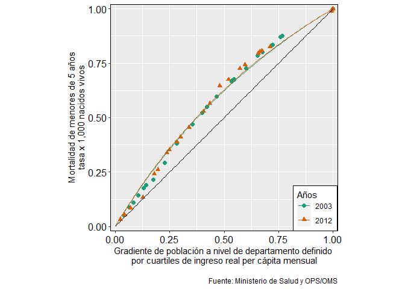

disparidad
================
L
2023-09-27

``` r
#Paquetes

library(tidyverse)
```

    ## ── Attaching core tidyverse packages ──────────────────────── tidyverse 2.0.0 ──
    ## ✔ dplyr     1.1.1     ✔ readr     2.1.4
    ## ✔ forcats   1.0.0     ✔ stringr   1.5.0
    ## ✔ ggplot2   3.4.2     ✔ tibble    3.2.1
    ## ✔ lubridate 1.9.2     ✔ tidyr     1.3.0
    ## ✔ purrr     1.0.1     
    ## ── Conflicts ────────────────────────────────────────── tidyverse_conflicts() ──
    ## ✖ dplyr::filter() masks stats::filter()
    ## ✖ dplyr::lag()    masks stats::lag()
    ## ℹ Use the conflicted package (<http://conflicted.r-lib.org/>) to force all conflicts to become errors

``` r
library(rio)
library(zoo)
```

    ## 
    ## Attaching package: 'zoo'
    ## 
    ## The following objects are masked from 'package:base':
    ## 
    ##     as.Date, as.Date.numeric

``` r
library(optimx)

data <- import("C:/Users/luisl/iCloudDrive/r/data_disparidad/data/data.xlsx") 
```

    ## New names:
    ## • `` -> `...3`
    ## • `` -> `...4`
    ## • `` -> `...6`
    ## • `` -> `...7`
    ## • `` -> `...9`
    ## • `` -> `...10`
    ## • `` -> `...12`
    ## • `` -> `...13`
    ## • `` -> `...15`
    ## • `` -> `...16`
    ## • `` -> `...18`
    ## • `` -> `...19`
    ## • `` -> `...21`
    ## • `` -> `...22`
    ## • `` -> `...24`

``` r
#elimnar columnas

data_c <- data %>%
  select_if(~ !all(is.na(.)))

glimpse(data_c)
```

    ## Rows: 38
    ## Columns: 17
    ## $ departamento          <chr> NA, "Amazonas", "Ancash", "Apurimac", "Arequipa"…
    ## $ `población total`     <chr> "2003", "435556", "1123410", "470719", "1113916"…
    ## $ ...3                  <chr> "2012", "419404", "1135962", "454324", "1259162"…
    ## $ `nacidos vivos`       <dbl> 2003, 12631, 25951, 13086, 21721, 14755, 42292, …
    ## $ ...6                  <dbl> 2012, 9367, 22861, 10611, 21113, 16069, 32116, 2…
    ## $ `ingreso per cápita`  <dbl> 2003.0, 158.6, 254.3, 159.7, 465.0, 169.8, 233.6…
    ## $ ...9                  <dbl> 2012.0, 543.0, 703.9, 427.1, 1009.7, 475.1, 530.…
    ## $ `mortalidad infantil` <chr> "2003", "35.5", "36.700000000000003", "52", "33.…
    ## $ ...12                 <dbl> 2012.000000, 23.699295, 14.857411, 22.161614, 9.…
    ## $ `mortalidad niñez`    <dbl> 2003, 69, 72, 93, 58, 68, 69, 108, 108, 93, 32, …
    ## $ ...15                 <dbl> 2012.00000, 34.20001, 18.99967, 27.20609, 12.798…
    ## $ `incidencia TB`       <dbl> 2003.00000, 38.54285, 89.18352, 28.71758, 115.07…
    ## $ ...18                 <dbl> 2012.00000, 28.98148, 68.35542, 27.21956, 59.506…
    ## $ `médicos x hb`        <dbl> 2003.00, 3.77, 4.25, 3.63, 10.78, 4.56, 2.12, 3.…
    ## $ ...21                 <dbl> 2012.00, 6.91, 6.29, 9.55, 13.33, 6.58, 4.27, 7.…
    ## $ `esperanza de vida`   <dbl> 2003.0, 67.7, 70.1, 63.7, 73.1, 63.8, 68.9, 62.3…
    ## $ ...24                 <dbl> 2012.00, 70.56, 73.81, 70.23, 76.27, 70.81, 72.9…

``` r
#filtrar data
data_c <- data_c %>% slice(2:25)
```

``` r
# setear nombres de columnas
colnames(data_c) <- c("departmento", "pop_2003", "pop_2012", "nacidovivo_2003", "nacidovivo_2012", "ingresopc_2003", "ingresopc_2012", "mortinf_2003", "mortinf_2012",                     "mortniñez_2003", "mortniñez_2012", "incidtb_2003", "incidtb_2012",
                    "medxhb_2003","medxhb_2012", "esperanzavida_2003", "esperanzavida2012")

glimpse(data_c)
```

    ## Rows: 24
    ## Columns: 17
    ## $ departmento        <chr> "Amazonas", "Ancash", "Apurimac", "Arequipa", "Ayac…
    ## $ pop_2003           <chr> "435556", "1123410", "470719", "1113916", "561029",…
    ## $ pop_2012           <chr> "419404", "1135962", "454324", "1259162", "673609",…
    ## $ nacidovivo_2003    <dbl> 12631, 25951, 13086, 21721, 14755, 42292, 31682, 14…
    ## $ nacidovivo_2012    <dbl> 9367, 22861, 10611, 21113, 16069, 32116, 26139, 140…
    ## $ ingresopc_2003     <dbl> 158.6, 254.3, 159.7, 465.0, 169.8, 233.6, 225.2, 14…
    ## $ ingresopc_2012     <dbl> 543.0, 703.9, 427.1, 1009.7, 475.1, 530.4, 701.6, 4…
    ## $ mortinf_2003       <chr> "35.5", "36.700000000000003", "52", "33.6", "44.6",…
    ## $ mortinf_2012       <dbl> 23.699295, 14.857411, 22.161614, 9.756409, 22.88042…
    ## $ mortniñez_2003     <dbl> 69, 72, 93, 58, 68, 69, 108, 108, 93, 32, 62, 60, 4…
    ## $ mortniñez_2012     <dbl> 34.20001, 18.99967, 27.20609, 12.79857, 29.47011, 2…
    ## $ incidtb_2003       <dbl> 38.54285, 89.18352, 28.71758, 115.07668, 72.08339, …
    ## $ incidtb_2012       <dbl> 28.98148, 68.35542, 27.21956, 59.50608, 32.73131, 1…
    ## $ medxhb_2003        <dbl> 3.77, 4.25, 3.63, 10.78, 4.56, 2.12, 3.94, 2.30, 3.…
    ## $ medxhb_2012        <dbl> 6.91, 6.29, 9.55, 13.33, 6.58, 4.27, 7.62, 7.43, 4.…
    ## $ esperanzavida_2003 <dbl> 67.7, 70.1, 63.7, 73.1, 63.8, 68.9, 62.3, 59.1, 66.…
    ## $ esperanzavida2012  <dbl> 70.56, 73.81, 70.23, 76.27, 70.81, 72.94, 70.31, 69…

``` r
# formato numerico...
data_c <- data_c %>% mutate(across(-departmento, as.numeric))
glimpse(data_c)
```

    ## Rows: 24
    ## Columns: 17
    ## $ departmento        <chr> "Amazonas", "Ancash", "Apurimac", "Arequipa", "Ayac…
    ## $ pop_2003           <dbl> 435556, 1123410, 470719, 1113916, 561029, 1515827, …
    ## $ pop_2012           <dbl> 419404, 1135962, 454324, 1259162, 673609, 1519764, …
    ## $ nacidovivo_2003    <dbl> 12631, 25951, 13086, 21721, 14755, 42292, 31682, 14…
    ## $ nacidovivo_2012    <dbl> 9367, 22861, 10611, 21113, 16069, 32116, 26139, 140…
    ## $ ingresopc_2003     <dbl> 158.6, 254.3, 159.7, 465.0, 169.8, 233.6, 225.2, 14…
    ## $ ingresopc_2012     <dbl> 543.0, 703.9, 427.1, 1009.7, 475.1, 530.4, 701.6, 4…
    ## $ mortinf_2003       <dbl> 35.5, 36.7, 52.0, 33.6, 44.6, 42.1, 49.3, 52.4, 44.…
    ## $ mortinf_2012       <dbl> 23.699295, 14.857411, 22.161614, 9.756409, 22.88042…
    ## $ mortniñez_2003     <dbl> 69, 72, 93, 58, 68, 69, 108, 108, 93, 32, 62, 60, 4…
    ## $ mortniñez_2012     <dbl> 34.20001, 18.99967, 27.20609, 12.79857, 29.47011, 2…
    ## $ incidtb_2003       <dbl> 38.54285, 89.18352, 28.71758, 115.07668, 72.08339, …
    ## $ incidtb_2012       <dbl> 28.98148, 68.35542, 27.21956, 59.50608, 32.73131, 1…
    ## $ medxhb_2003        <dbl> 3.77, 4.25, 3.63, 10.78, 4.56, 2.12, 3.94, 2.30, 3.…
    ## $ medxhb_2012        <dbl> 6.91, 6.29, 9.55, 13.33, 6.58, 4.27, 7.62, 7.43, 4.…
    ## $ esperanzavida_2003 <dbl> 67.7, 70.1, 63.7, 73.1, 63.8, 68.9, 62.3, 59.1, 66.…
    ## $ esperanzavida2012  <dbl> 70.56, 73.81, 70.23, 76.27, 70.81, 72.94, 70.31, 69…

## 

``` r
# Convertir datos a formato largo
data_long_w <- data_c %>%  
  pivot_longer(
    cols = -departmento, 
    names_to = "variable", 
    values_to = "valor"
  ) %>% 
  separate(variable, into = c('tipo', 'anio'), sep = '_') %>% 
  pivot_wider(names_from = tipo, values_from = valor)
```

    ## Warning: Expected 2 pieces. Missing pieces filled with `NA` in 24 rows [16, 32, 48, 64,
    ## 80, 96, 112, 128, 144, 160, 176, 192, 208, 224, 240, 256, 272, 288, 304, 320,
    ## ...].

``` r
glimpse(data_long_w)
```

    ## Rows: 72
    ## Columns: 11
    ## $ departmento       <chr> "Amazonas", "Amazonas", "Amazonas", "Ancash", "Ancas…
    ## $ anio              <chr> "2003", "2012", NA, "2003", "2012", NA, "2003", "201…
    ## $ pop               <dbl> 435556, 419404, NA, 1123410, 1135962, NA, 470719, 45…
    ## $ nacidovivo        <dbl> 12631, 9367, NA, 25951, 22861, NA, 13086, 10611, NA,…
    ## $ ingresopc         <dbl> 158.6, 543.0, NA, 254.3, 703.9, NA, 159.7, 427.1, NA…
    ## $ mortinf           <dbl> 35.500000, 23.699295, NA, 36.700000, 14.857411, NA, …
    ## $ mortniñez         <dbl> 69.00000, 34.20001, NA, 72.00000, 18.99967, NA, 93.0…
    ## $ incidtb           <dbl> 38.54285, 28.98148, NA, 89.18352, 68.35542, NA, 28.7…
    ## $ medxhb            <dbl> 3.77, 6.91, NA, 4.25, 6.29, NA, 3.63, 9.55, NA, 10.7…
    ## $ esperanzavida     <dbl> 67.7, NA, NA, 70.1, NA, NA, 63.7, NA, NA, 73.1, NA, …
    ## $ esperanzavida2012 <dbl> NA, NA, 70.56, NA, NA, 73.81, NA, NA, 70.23, NA, NA,…

``` r
inequality_clean <- data_long_w %>% 
  select(year = anio,
         hexp = ingresopc, #ingpc, espvid
         ir_mi = mortinf, #inctb, mortinf, mortnin, razmed
         population = nacidovivo, #pob, nacviv
         country = departmento) %>% 
  mutate(num_mortinfant = ir_mi*population/1000)
glimpse(inequality_clean)
```

    ## Rows: 72
    ## Columns: 6
    ## $ year           <chr> "2003", "2012", NA, "2003", "2012", NA, "2003", "2012",…
    ## $ hexp           <dbl> 158.6, 543.0, NA, 254.3, 703.9, NA, 159.7, 427.1, NA, 4…
    ## $ ir_mi          <dbl> 35.500000, 23.699295, NA, 36.700000, 14.857411, NA, 52.…
    ## $ population     <dbl> 12631, 9367, NA, 25951, 22861, NA, 13086, 10611, NA, 21…
    ## $ country        <chr> "Amazonas", "Amazonas", "Amazonas", "Ancash", "Ancash",…
    ## $ num_mortinfant <dbl> 448.4005, 221.9913, NA, 952.4017, 339.6553, NA, 680.472…

``` r
################################################################################
brecha_des <- inequality_clean %>% 
  select(year, hexp, population, ir_mi) %>%              # Seleccionamos variables de interes
  filter(year %in% c(2003, 2012)) %>%              # Filtramos años de interes
  group_by(year) %>% 
  mutate(qhexp = cut(hexp, quantile(hexp),
                     include.lowest = TRUE,
                     labels=c("Q1","Q2","Q3","Q4"))) %>% # Agrupar por cuantiles en funcion del gasto en salud
  ungroup() %>% 
  group_by(year, qhexp) %>% 
  mutate(qph = sum(population)) %>%                      # Suma de la poblacion de cada cuantil
  ungroup() %>% 
  group_by(year) %>% 
  mutate(wpoph = qph/sum(population),                    # Proporcion de la poblacion de cada cuantil sobre el total
         wpop = population/qph,                          # tasa entre la poblacion y la poblacion de cada su cuartil
         wrate = wpop*ir_mi) %>%                         # Ajustamos la incidencia en funcion a la poblacion
  ungroup() %>% 
  group_by(year, qhexp) %>% 
  summarise(meanh = round(sum(wrate), 2),                # Sumamos la incidencia por cada cuantil
            wpoph = mean(wpoph)) %>%                  
  ungroup()
```

    ## `summarise()` has grouped output by 'year'. You can override using the
    ## `.groups` argument.

``` r
g1 <- brecha_des %>% 
  ggplot(aes(x = factor(year), y = meanh, fill = qhexp))+
  geom_col(position = 'dodge', color="black", linewidth=0.7) + 
  geom_label(aes(label = meanh), color="black", fill="white",
             position = position_dodge2(width = 0.9),
             size = 4, hjust = 0.5, vjust = -0.5)+
  scale_fill_brewer(palette = 1,
                    labels = c('Q1 Más pobres', 'Q2', 'Q3', 'Q4 Menos pobres'))+
  labs(x = 'Cuántiles del gasto total en salud por persona', 
       y = "Mortalidad de menores de 5 años\ntasa x 1,000 nacidos vivos",
       fill = '',
       caption = "\nFuente: Ministerio de Salud y OPS/OMS")+
  scale_y_continuous(limits= c(0,52), breaks = seq(0,50,10), expand = c(0,0))+
  theme(legend.position = c(0.82, 0.87))
g1
```

<!-- -->

``` r
################################################################################
# Tabla: Metrics of country-level inequalities in TB incidence according to social stratifiers and year assessed -----------------

glimpse(brecha_des)
```

    ## Rows: 8
    ## Columns: 4
    ## $ year  <chr> "2003", "2003", "2003", "2003", "2012", "2012", "2012", "2012"
    ## $ qhexp <fct> Q1, Q2, Q3, Q4, Q1, Q2, Q3, Q4
    ## $ meanh <dbl> 45.31, 44.05, 34.56, 21.02, 26.53, 25.65, 21.25, 11.96
    ## $ wpoph <dbl> 0.1429807, 0.2785210, 0.2311592, 0.3473390, 0.1966339, 0.2090575…

``` r
df_aki <- brecha_des %>% 
  group_by(year) %>% 
  mutate(absolute_Kuznets_index = first(meanh) - last(meanh)) %>% 
  summarise(absolute_Kuznets_index = mean(absolute_Kuznets_index))

df_rki <- brecha_des %>% 
  group_by(year) %>% 
  mutate(relative_Kuznets_index = first(meanh) / last(meanh)) %>% 
  summarise(relative_Kuznets_index = mean(relative_Kuznets_index))

df_indices <- df_aki %>% 
  left_join(df_rki)
```

    ## Joining with `by = join_by(year)`

``` r
df_indices
```

    ## # A tibble: 2 × 3
    ##   year  absolute_Kuznets_index relative_Kuznets_index
    ##   <chr>                  <dbl>                  <dbl>
    ## 1 2003                    24.3                   2.16
    ## 2 2012                    14.6                   2.22

``` r
glimpse(df_indices)
```

    ## Rows: 2
    ## Columns: 3
    ## $ year                   <chr> "2003", "2012"
    ## $ absolute_Kuznets_index <dbl> 24.29, 14.57
    ## $ relative_Kuznets_index <dbl> 2.155566, 2.218227

``` r
# Figura 2: Health inequality for Health expenditure per capita ----------------

## 2.1) Filtramos años de interes y creamos variables
hexp <- inequality_clean %>% 
  select(country, year, population, hexp, num_mortinfant, ir_mi) %>%        # Seleccionamos variables de interes
  filter(year %in% c(2003, 2012)) %>%                               # Filtramos años de interes
  group_by(year) %>% 
  arrange(hexp) %>%                                          # Ordenamos la tabla en funcion a la gasto en salud (de menor a mayor)
  mutate(wpop = population/sum(population),                  # Tasa entre la poblacion y la poblacion de cada su cuartil
         cwpop = cumsum(wpop),                               # Suma acumulada de la tasa anterior
         ridit = (cwpop + lag(cwpop, default = 0))/2,        # Media movil de la suma acumulada (ventana de dos)
         whealth = num_mortinfant/sum(num_mortinfant),           # Proporcion de casos respecto al total
         cwhealth = cumsum(whealth),                         # Suma acumulada de la proporcion anterior
         logridit = log10(ridit),                            # Logaritmo de ridit
         wi = sqrt(population),                              
         xiwi = wi*logridit,
         yiwi = wi*ir_mi
  ) %>% 
  ungroup()

## 2.2) Realizamos la prediccion para cada año

# 2003
hexp_2003 <- hexp %>% filter(year == 2003)

f_2003 <- lm(hexp_2003$yiwi ~ hexp_2003$wi + hexp_2003$xiwi + 0)

hexp_2003 <- hexp_2003 %>% 
  mutate(predict = coef(summary(f_2003))[1,1] + coef(summary(f_2003))[2,1]*logridit)

slope_index_2003 <- f_2003$coefficients[2]


# 2012
hexp_2012 <- hexp %>% filter(year == 2012)

f_2012 <- lm(hexp_2012$yiwi ~ hexp_2012$wi + hexp_2012$xiwi + 0)

hexp_2012 <- hexp_2012 %>% 
  mutate(predict = coef(summary(f_2012))[1,1] + coef(summary(f_2012))[2,1]*logridit)

slope_index_2012 <- f_2012$coefficients[2]


## 2.3) Unimos las tablas generadas para cada año
hexp_2002_2012 <- bind_rows(hexp_2003, hexp_2012)

## 2.4) Graficamos

g2 <- hexp_2002_2012 %>% 
  ggplot()+
  geom_point(aes(x = ridit, y = ir_mi, color = factor(year), shape = factor(year)), size =3)+
  geom_line(aes(x = ridit, y = predict, color = factor(year), linetype = factor(year)), size = 1.5)+
       
  labs(x = 'Gradiente de población a nivel de departamento definido \npor el gasto total en salud por persona',
       y = "Mortalidad de menores de 5 años\ntasa x 1,000 nacidos vivos",
       caption = "\nFuente: Ministerio de Salud y OPS/OMS",
      color = 'Años', shape = 'Años', linetype = 'Años')+
  scale_y_continuous(limits= c(4,56), breaks = seq(5,55,10))+
  theme(legend.position = c(0.82, 0.87))
```

    ## Warning: Using `size` aesthetic for lines was deprecated in ggplot2 3.4.0.
    ## ℹ Please use `linewidth` instead.
    ## This warning is displayed once every 8 hours.
    ## Call `lifecycle::last_lifecycle_warnings()` to see where this warning was
    ## generated.

``` r
g2
```

    ## Warning: Removed 1 row containing missing values (`geom_line()`).

<!-- -->

``` r
################################################################################
# Figura 3: Concentration Curve: health expenditure per capita -----------------

## 3.1) Generamos las funciones para el calculo de la curva
ccurve_f <- function(k,mydata){
  sum((mydata$y-(exp(mydata$x/(k-mydata$x))-1)/(exp(1/(k-1))-1)))^2
}
f<-function(x,k) {
  (exp(x/(k-x))-1)/(exp(1/(k-1))-1)
}

## 3.2) Calculo de la curva por años

# 2003
df_ano_curve <- rbind(c(0, 0), hexp_2003 %>%
                        select(y = cwhealth, x = cwpop))

ccurve <- optimx(par=-1.5, fn=ccurve_f, mydata=df_ano_curve, control=list(all.methods=TRUE, save.failures=TRUE, maxit=2500))
```

    ## Warning in optim(par = par, fn = ufn, gr = ugr, method = meth, control = mcontrol, : one-dimensional optimization by Nelder-Mead is unreliable:
    ## use "Brent" or optimize() directly

    ## Warning in (function (npt = min(n + 2L, 2L * n), rhobeg = NA, rhoend = NA, :
    ## unused control arguments ignored

    ## Warning in (function (npt = min(n + 2L, 2L * n), rhobeg = NA, rhoend = NA, :
    ## unused control arguments ignored

``` r
x<-seq(0,1,0.01)
k<-ccurve[1,1]
line_curve_1 <-f(x,k)

# 2012
df_ano_curve <- rbind(c(0, 0), hexp_2012 %>%
                        select(y = cwhealth, x = cwpop))

ccurve <- optimx(par=-1.5, fn=ccurve_f, mydata=df_ano_curve, control=list(all.methods=TRUE, save.failures=TRUE, maxit=2500))
```

    ## Warning in optim(par = par, fn = ufn, gr = ugr, method = meth, control = mcontrol, : one-dimensional optimization by Nelder-Mead is unreliable:
    ## use "Brent" or optimize() directly

    ## Warning in (function (npt = min(n + 2L, 2L * n), rhobeg = NA, rhoend = NA, :
    ## unused control arguments ignored

    ## Warning in (function (npt = min(n + 2L, 2L * n), rhobeg = NA, rhoend = NA, :
    ## unused control arguments ignored

``` r
x<-seq(0,1,0.01)
k<-ccurve[1,1]
line_curve_2 <-f(x,k)


## 3.3) Unimos las bases
df_curvas <- bind_rows(data.frame(val = line_curve_1, x = x, ano = 2003),
                       data.frame(val = line_curve_2, x = x, ano = 2012))

## 3.4) Graficamos

g3 <- bind_rows(hexp_2003, hexp_2012) %>% 
  ggplot()+
  geom_point(aes(x = cwpop, y = cwhealth, color = factor(year),
                 fill = factor(year), shape = factor(year)), size = 2)+
  geom_line(data = df_curvas, aes(x = x, y = val, color = factor(ano)))+
  geom_line(data = df_curvas, aes(x = x, y = x))+
  scale_color_brewer(type = 'qual', palette = 2)+
  theme(legend.position = c(0.9, 0.1),
        legend.spacing.y = unit(0, "mm"), 
        panel.border = element_rect(colour = "black", fill=NA),
        aspect.ratio = 1, axis.text = element_text(colour = 1, size = 12),
        legend.background = element_blank(),
        legend.box.background = element_rect(colour = "black"))+
  labs(x = 'Gradiente de población a nivel de departamento definido \npor cuartiles de ingreso real per cápita mensual',
       y = "Mortalidad de menores de 5 años\ntasa x 1,000 nacidos vivos",
       caption = "\nFuente: Ministerio de Salud y OPS/OMS",
       fill = 'Años', color = 'Años', linetype = 'Años', shape = 'Años')+
  scale_y_continuous( expand = c(0,0.02))+
  scale_x_continuous( expand = c(0,0.02))+
  theme(
    plot.title = element_text(hjust = 0.5, face = 'bold'),
    plot.subtitle = element_text(hjust = 0.5)
  )
g3
```

<!-- -->

``` r
library(gdata)
```

    ## 
    ## Attaching package: 'gdata'

    ## The following objects are masked from 'package:dplyr':
    ## 
    ##     combine, first, last

    ## The following object is masked from 'package:purrr':
    ## 
    ##     keep

    ## The following object is masked from 'package:stats':
    ## 
    ##     nobs

    ## The following object is masked from 'package:utils':
    ## 
    ##     object.size

    ## The following object is masked from 'package:base':
    ## 
    ##     startsWith

``` r
library(epiDisplay)
```

    ## Loading required package: foreign

    ## Loading required package: survival

    ## Loading required package: MASS

    ## 
    ## Attaching package: 'MASS'

    ## The following object is masked from 'package:dplyr':
    ## 
    ##     select

    ## Loading required package: nnet

    ## 
    ## Attaching package: 'epiDisplay'

    ## The following object is masked from 'package:ggplot2':
    ## 
    ##     alpha

``` r
library(grDevices)
library(lattice)
```

    ## 
    ## Attaching package: 'lattice'

    ## The following object is masked from 'package:epiDisplay':
    ## 
    ##     dotplot

``` r
library(grid)
library(scatterplot3d)
library(arm)
```

    ## Loading required package: Matrix

    ## 
    ## Attaching package: 'Matrix'

    ## The following objects are masked from 'package:tidyr':
    ## 
    ##     expand, pack, unpack

    ## Loading required package: lme4

    ## 
    ## Attaching package: 'lme4'

    ## The following object is masked from 'package:rio':
    ## 
    ##     factorize

    ## 
    ## arm (Version 1.13-1, built: 2022-8-25)

    ## Working directory is C:/Users/luisl/iCloudDrive/r/data_disparidad/code

``` r
library(reldist)
```

    ## reldist: Relative Distribution Methods
    ## Version 1.7-2 created on 2023-02-16.
    ## copyright (c) 2003, Mark S. Handcock, University of California-Los Angeles
    ##  For citation information, type citation("reldist").
    ##  Type help(package="reldist") to get started.

``` r
library(ineq)
```

    ## 
    ## Attaching package: 'ineq'

    ## The following object is masked from 'package:reldist':
    ## 
    ##     entropy

``` r
library(Hmisc)
```

    ## Loading required package: Formula

    ## 
    ## Attaching package: 'Hmisc'

    ## The following objects are masked from 'package:reldist':
    ## 
    ##     wtd.mean, wtd.quantile, wtd.var

    ## The following objects are masked from 'package:dplyr':
    ## 
    ##     src, summarize

    ## The following objects are masked from 'package:base':
    ## 
    ##     format.pval, units

``` r
library(lawstat)
library(car)
```

    ## Loading required package: carData

    ## 
    ## Attaching package: 'car'

    ## The following object is masked from 'package:lawstat':
    ## 
    ##     levene.test

    ## The following object is masked from 'package:arm':
    ## 
    ##     logit

    ## The following object is masked from 'package:dplyr':
    ## 
    ##     recode

    ## The following object is masked from 'package:purrr':
    ## 
    ##     some

``` r
library(gplots)
```

    ## Registered S3 method overwritten by 'gplots':
    ##   method         from 
    ##   reorder.factor gdata

    ## 
    ## Attaching package: 'gplots'

    ## The following object is masked from 'package:gdata':
    ## 
    ##     reorder.factor

    ## The following object is masked from 'package:stats':
    ## 
    ##     lowess

``` r
library(plotly)
```

    ## 
    ## Attaching package: 'plotly'

    ## The following object is masked from 'package:Hmisc':
    ## 
    ##     subplot

    ## The following object is masked from 'package:MASS':
    ## 
    ##     select

    ## The following object is masked from 'package:rio':
    ## 
    ##     export

    ## The following object is masked from 'package:ggplot2':
    ## 
    ##     last_plot

    ## The following object is masked from 'package:stats':
    ## 
    ##     filter

    ## The following object is masked from 'package:graphics':
    ## 
    ##     layout

``` r
library(latticeExtra)
```

    ## 
    ## Attaching package: 'latticeExtra'

    ## The following object is masked from 'package:ggplot2':
    ## 
    ##     layer

``` r
library(VIM)
```

    ## Loading required package: colorspace

    ## VIM is ready to use.

    ## Suggestions and bug-reports can be submitted at: https://github.com/statistikat/VIM/issues

    ## 
    ## Attaching package: 'VIM'

    ## The following object is masked from 'package:datasets':
    ## 
    ##     sleep

``` r
library(reshape)
```

    ## 
    ## Attaching package: 'reshape'

    ## The following object is masked from 'package:plotly':
    ## 
    ##     rename

    ## The following object is masked from 'package:Matrix':
    ## 
    ##     expand

    ## The following object is masked from 'package:lubridate':
    ## 
    ##     stamp

    ## The following object is masked from 'package:dplyr':
    ## 
    ##     rename

    ## The following objects are masked from 'package:tidyr':
    ## 
    ##     expand, smiths

``` r
library(psych)
```

    ## 
    ## Attaching package: 'psych'

    ## The following object is masked from 'package:car':
    ## 
    ##     logit

    ## The following object is masked from 'package:Hmisc':
    ## 
    ##     describe

    ## The following objects are masked from 'package:arm':
    ## 
    ##     logit, rescale, sim

    ## The following objects are masked from 'package:epiDisplay':
    ## 
    ##     alpha, cs, lookup

    ## The following objects are masked from 'package:ggplot2':
    ## 
    ##     %+%, alpha

``` r
library(optimx) ## algoritmo
```

``` r
#2003
# dplyr
library(dplyr)

# Filtrar los datos para el año 2003 y ordenar por 'hexp'
hexp2003sort <- inequality_clean %>%
  filter(year == "2003") %>%
  arrange(hexp) %>%
  mutate(
    population = as.numeric(population), # Convertir la población a numérico
    totalp = sum(population, na.rm = TRUE), # Calcular la suma total de la población
    totaltb = sum(num_mortinfant, na.rm = TRUE), # Calcular la suma total de num_mortinfant
    Wpop = population / totalp, # Calcular Wpop
    CWpop = cumsum(Wpop) # Calcular CWpop
  )


hexp2003sort
```

    ## # A tibble: 24 × 10
    ##    year   hexp ir_mi population country     num_m…¹ totalp totaltb   Wpop  CWpop
    ##    <chr> <dbl> <dbl>      <dbl> <chr>         <dbl>  <dbl>   <dbl>  <dbl>  <dbl>
    ##  1 2003   138.  44        23861 Huanuco       1050. 599829  20417. 0.0398 0.0398
    ##  2 2003   147.  52.4      14629 Huancaveli…    767. 599829  20417. 0.0244 0.0642
    ##  3 2003   159.  35.5      12631 Amazonas       448. 599829  20417. 0.0211 0.0852
    ##  4 2003   160.  52        13086 Apurimac       680. 599829  20417. 0.0218 0.107 
    ##  5 2003   170.  44.6      14755 Ayacucho       658. 599829  20417. 0.0246 0.132 
    ##  6 2003   207.  41.6       6802 Pasco          283. 599829  20417. 0.0113 0.143 
    ##  7 2003   216.  28.9      18583 San Martin     537. 599829  20417. 0.0310 0.174 
    ##  8 2003   225.  49.3      31682 Cusco         1562. 599829  20417. 0.0528 0.227 
    ##  9 2003   231   53.1      33935 Puno          1802. 599829  20417. 0.0566 0.283 
    ## 10 2003   234.  42.1      42292 Cajamarca     1780. 599829  20417. 0.0705 0.354 
    ## # … with 14 more rows, and abbreviated variable name ¹​num_mortinfant

``` r
# Para el gráfico, si es necesario
# ph <- ggplot(hexp2003sort, aes(x = country, y = hexp)) + geom_col()

# ph <- ggplot(hexp2010, aes(country, hexp)) + geom_col()
# ggplotly(ph)
```

``` r
#2003
# Cargar librerías necesarias
library(dplyr)
library(ggplot2)
```

``` r
# Preparación de datos
hexp2010sort <- inequality_clean %>%
  filter(year == "2003") %>%
  arrange(hexp) %>%
  mutate(
    population = as.numeric(population),
    totalp = sum(population, na.rm = TRUE),
    totaltb = sum(num_mortinfant, na.rm = TRUE),
    Wpop = population / totalp,
    CWpop = cumsum(Wpop),
    ridit = (lag(CWpop, default = 0) + CWpop) / 2,
    Whealth = num_mortinfant / totaltb,
    CWhealth = cumsum(Whealth),
    logridit = log10(ridit),
    Wi = sqrt(population),
    XiWi = Wi * logridit,
    YiWi = Wi * ir_mi
  )

# Modelamiento
fit2003 <- lm(YiWi ~ Wi + XiWi + 0, data = hexp2010sort)
fit_summary <- summary(fit2003)

# Predicción
hexp2010sort <- hexp2010sort %>%
  mutate(predict2010 = coef(fit_summary)[1] + coef(fit_summary)[2] * logridit)

# Gráfico
ggplot(hexp2010sort, aes(x = ridit, y = ir_mi)) +
  geom_point(color = "red", shape = 0) +
  geom_line(aes(y = predict2010), color = "red", lty = 1) +
  labs(
    x = "Country-level population gradient defined by total health expenditure per capita",
    y = "Tasa de incidencia de mortalidad infantil x 1000 nacidos vivos"
  )
```

<!-- -->

``` r
# Carga las bibliotecas necesarias
library(dplyr)

# Función para calcular los ridits
calculate_ridits <- function(cwpop) {
  sapply(1:length(cwpop), function(i) {
    if (i == 1) {
      return (0 + cwpop[i]) / 2
    } else {
      return (cwpop[i - 1] + cwpop[i]) / 2
    }
  })
}

# Análisis para el año 2005
hexp2005sort <- hexp %>%
  filter(year == "2012") %>% # Filtra por año (nota que el código original usaba "2012", no "2005")
  arrange(hexp) %>%          # Ordena por hexp
  mutate(
    Wpop = population / sum(population),
    CWpop = cumsum(Wpop),
    ridit = calculate_ridits(CWpop),
    Whealth = num_mortinfant / sum(num_mortinfant),
    CWhealth = cumsum(Whealth),
    logridit = log10(ridit),
    Wi = sqrt(population),
    XiWi = Wi * logridit,
    YiWi = Wi * ir_mi
  )

# Ajustar modelo lineal
fit2012 <- lm(YiWi ~ Wi + XiWi + 0, data = hexp2005sort)

# Resumen del modelo
fit_summary <- summary(fit2012)

# Predicciones para el año 2005
hexp2005sort <- hexp2005sort %>% 
  mutate(predict2005 = coef(fit_summary)[1] + coef(fit_summary)[2] * logridit)
```

``` r
################################################################################
## Grafico 
# Combinar los datos de 2005 y 2010 en un único conjunto de datos
hexp_combined <- bind_rows(
  hexp2005sort %>% mutate(year = "2003", prediction = predict2005),
  hexp2010sort %>% mutate(year = "2012", prediction = predict2010)
)

# Gráfico con ggplot2
ggplot(hexp_combined, aes(x = ridit, y = ir_mi, color = factor(year))) +
  geom_point(aes(shape = factor(year)), size = 3) + 
  geom_line(aes(y = prediction, linetype = factor(year))) +
  scale_color_manual(values = c("blue", "red")) +
  scale_shape_manual(values = c(16, 17)) +
  scale_linetype_manual(values = c("dashed", "solid")) +
  labs(
    title = "Tuberculosis Incidence Rates vs Health Expenditure",
    y = "Tuberculosis incidence rates per 100,000 population",
    x = "Country-level population gradient defined by total health expenditure per capita"
  ) +
  theme_minimal() +
  theme(legend.title = element_blank()) +
  guides(color = guide_legend(override.aes = list(shape = c(16, 17))))
```

<!-- -->

``` r
################################################################################
# Social gradient
slope_index_of_inequality_hexp2003<-fit2003$coefficients[2]
slope_index_of_inequality_hexp2012<-fit2012$coefficients[2]


round(slope_index_of_inequality_hexp2003,2)
```

    ##   XiWi 
    ## -19.58

``` r
round(slope_index_of_inequality_hexp2012,2)
```

    ##   XiWi 
    ## -10.96

``` r
print(fit2003) 
```

    ## 
    ## Call:
    ## lm(formula = YiWi ~ Wi + XiWi + 0, data = hexp2010sort)
    ## 
    ## Coefficients:
    ##     Wi    XiWi  
    ##  25.65  -19.58

``` r
print(fit2012) 
```

    ## 
    ## Call:
    ## lm(formula = YiWi ~ Wi + XiWi + 0, data = hexp2005sort)
    ## 
    ## Coefficients:
    ##     Wi    XiWi  
    ##  18.61  -10.96
